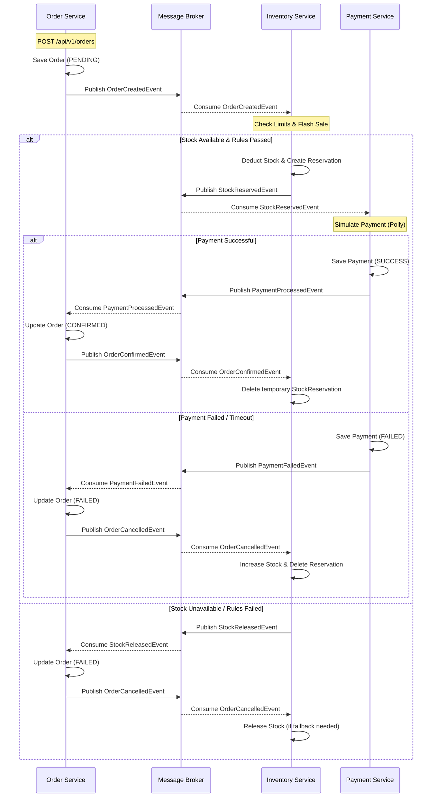

# Order Management System - Event-Driven Architecture Flow

Below you can see the complete flow of event-driven communication between the microservices.

## 1. Flow Steps (Event & Consumer Mappings)

### A. Order Initiation
1. **Order Service:** User creates an order. The order is saved to the database with a `PENDING` status.
2. **Published Event:** `OrderCreatedEvent` is published.

### B. Stock Control (Inventory Service)
3. **Listening Consumer:** `OrderCreatedEventConsumer` (Inventory Service)
4. **Action:** 50% stock rule and Flash Sale rules are checked.
   - **If Successful:** Product stock is deducted, and a temporary record is inserted into the `StockReservation` table (valid for 10 minutes).
     - **Published Event:** `StockReservedEvent`
   - **If Failed:** Insufficient stock or rule violation.
     - **Published Event:** `StockReleasedEvent`

### C. Payment Processing (Payment Service)
5. **Listening Consumer:** `StockReservedEventConsumer` (Payment Service)
6. **Action:** Payment simulation runs using Polly (Retry mechanism is triggered on failure).
   - **If Successful:** Payment is saved as `SUCCESS`.
     - **Published Event:** `PaymentProcessedEvent`
   - **If Failed:** Payment is saved as `FAILED` (e.g., Timeout, Fraud limit).
     - **Published Event:** `PaymentFailedEvent`

### D. Order Finalization (Saga / Compensating Transactions)
The order status is updated by the Order Service based on the results from the Payment and Inventory services.

**Scenario 1: Successful Completion**
- **Listening Consumer:** `PaymentProcessedEventConsumer` (Order Service)
- **Action:** Order status is updated to `CONFIRMED`.
- **Published Event:** `OrderConfirmedEvent` is published.
- **Final Step:** `OrderConfirmedEventConsumer` (Inventory Service) listens to this and deletes the temporary `StockReservation` record for the successfully completed order.

**Scenario 2: Cancellation Due to Payment Failure**
- **Listening Consumer:** `PaymentFailedEventConsumer` (Order Service)
- **Action:** Order status is updated to `FAILED`.
- **Published Event:** `OrderCancelledEvent` is published.
- **Final Step:** `OrderCancelledEventConsumer` (Inventory Service) listens to this and restores (releases) the reserved stock, completing the cancellation process.

**Scenario 3: Cancellation Due to Stock Failure**
- **Listening Consumer:** `StockReleasedEventConsumer` (Order Service)
- **Action:** Order status is updated to `FAILED`.
- **Published Event:** `OrderCancelledEvent` is published. (Inventory Service listens to this, but since no stock was actually deducted, no further action is needed).

---

## 2. Architecture Diagram (Mermaid)

You can paste the schema below into the **"Insert -> Mermaid"** option (or `More Tools -> Mermaid` menu) in Excalidraw to convert it directly into an editable Excalidraw drawing.

